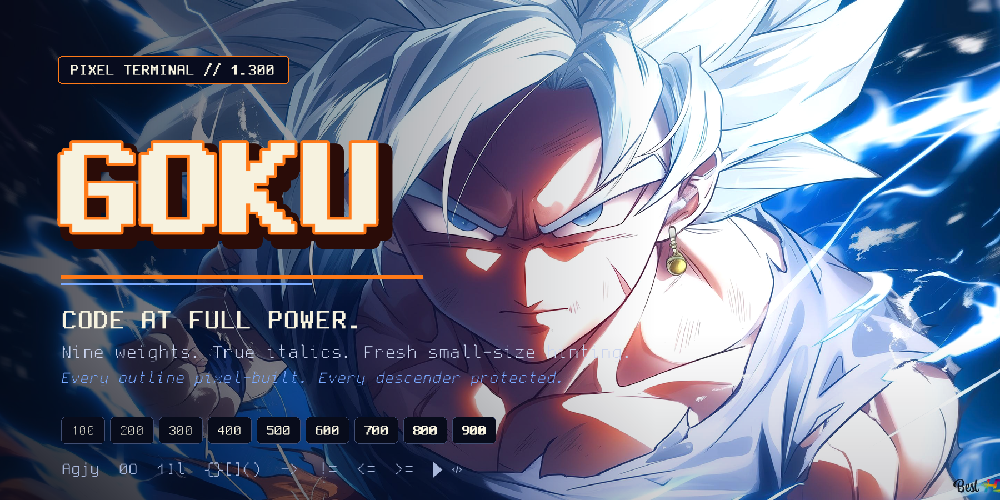
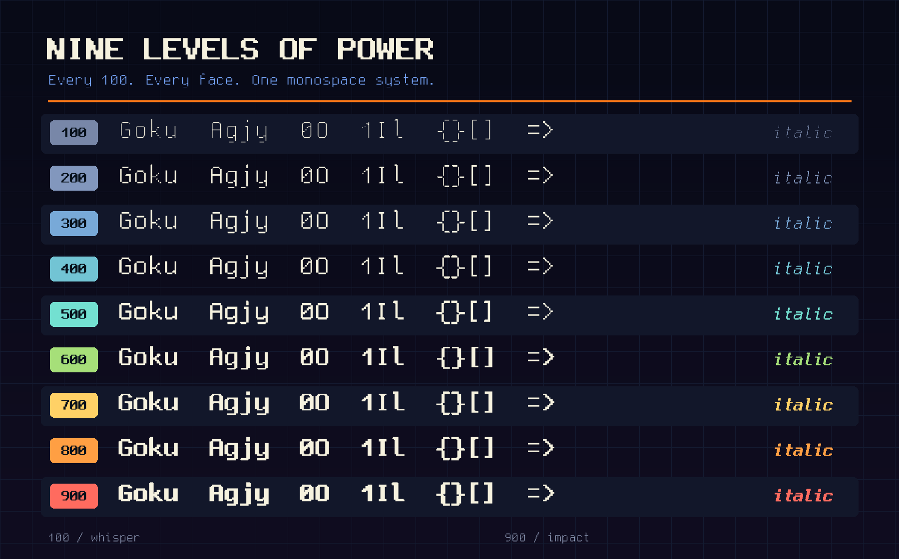
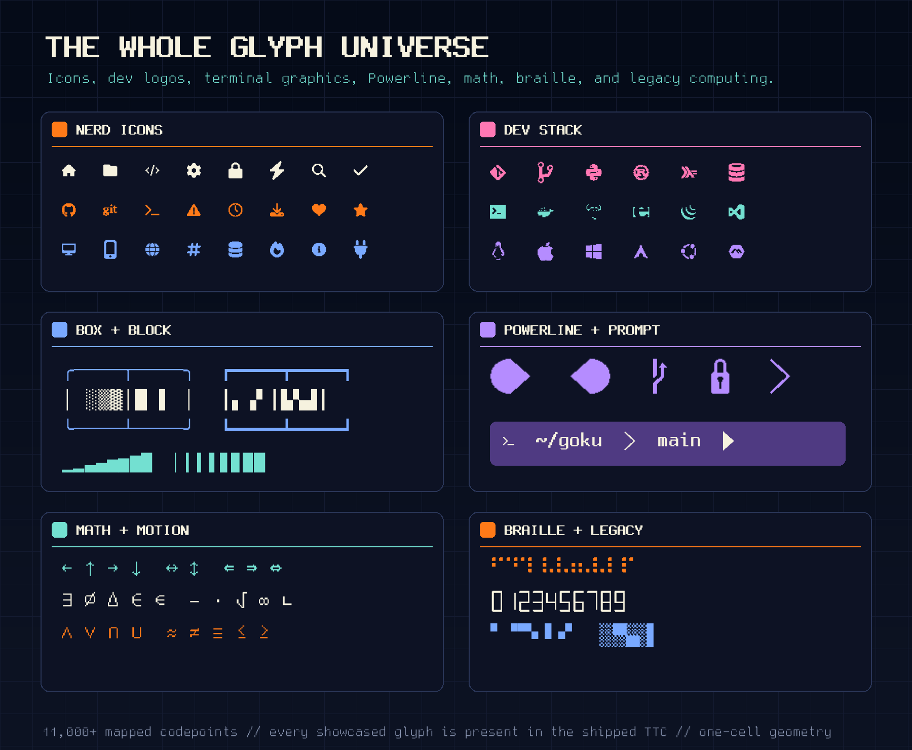
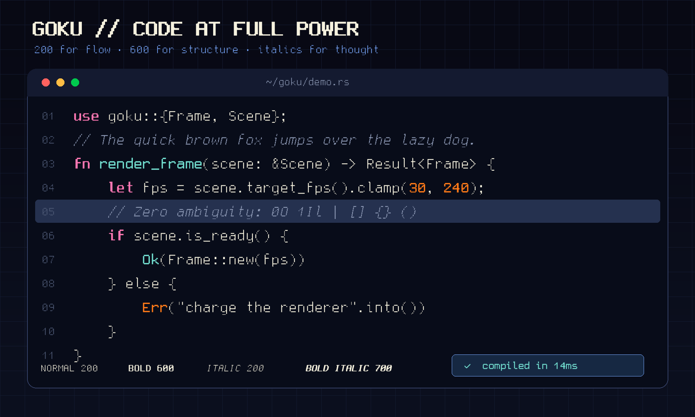
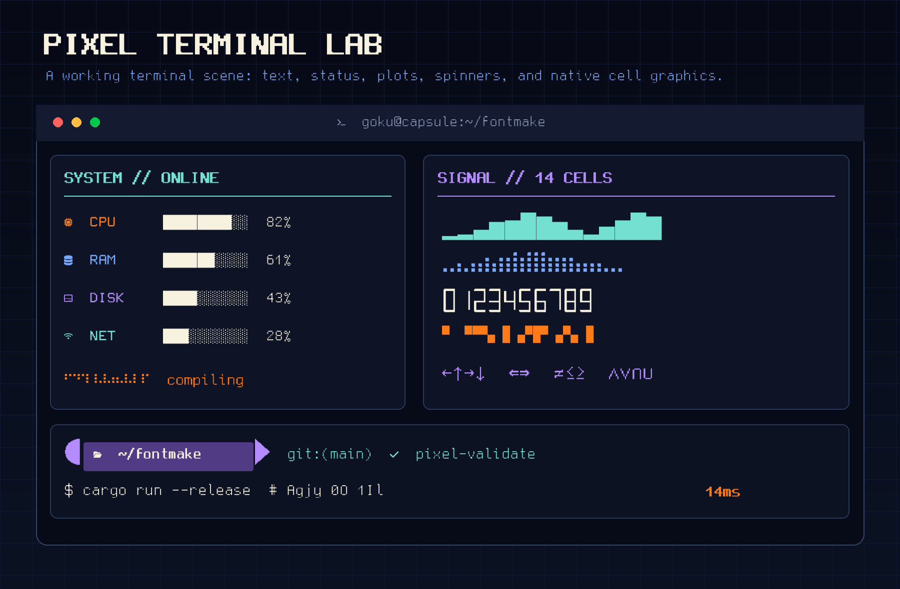

# Goku terminal font

<p align="center">
  
</p>

Goku is a vector, monospaced terminal font derived from the handcrafted Gohu
uni14 bitmap design. `Goku Pixel` rebuilds the complete collection—text,
italics, symbols, terminal graphics, and Nerd Font icons—on one crisp pixel
grid. The previews below are rendered directly from `Goku-Pixel.ttc`.

## Preview

<p align="center">
  
</p>

<p align="center">
  
</p>

<p align="center">
  
</p>

<p align="center">
  
</p>

The collection contains 18 faces. Upright and italic variants are available at
every numeric weight from `100` through `900`:

| Weight | Upright PostScript name | Italic PostScript name |
| ---: | --- | --- |
| 100 | `Goku-100` | `Goku-100Italic` |
| 200 | `Goku-200` | `Goku-200Italic` |
| 300 | `Goku-300` | `Goku-300Italic` |
| 400 | `Goku-400` | `Goku-400Italic` |
| 500 | `Goku-500` | `Goku-500Italic` |
| 600 | `Goku-600` | `Goku-600Italic` |
| 700 | `Goku-700` | `Goku-700Italic` |
| 800 | `Goku-800` | `Goku-800Italic` |
| 900 | `Goku-900` | `Goku-900Italic` |

There are no Thin, Light, Medium, SemiBold, or Bold-named release faces. The
numeric face is the complete identity. Weight `400` preserves the approved
Gohu regular-derived design and hinting; `700` preserves the real Gohu Bold as
its source instead of mechanically emboldening Regular. Both anchors receive
the same text-edge clearance treatment. The surrounding weights form a
visually monotonic scale around those two anchors.

## Terminal geometry

- 2048 units per em
- 1170-unit monospaced advance, corresponding to Gohu's 8-pixel width
- 1609-unit ascent and -439-unit descent, preserving the native 11/3 baseline
- zero line gap, so the 14-pixel source grid fills one complete terminal cell
- 1024-unit x-height and 1317-unit cap height

Do not compensate with Kitty's `modify_font cell_width`: compressing the
correct cell makes letters and bold strokes collide. Adjust `font_size` or
choose a different numeric weight instead.

## Rendering guarantees

- All 18 faces keep the same monospaced advances and character coverage.
- Ordinary upright text has outline clearance from every cell edge: shortened
  descenders, a half-source-pixel side inset, and protected top accents.
- Cell-spanning em dashes, terminal graphics, icons, and Powerline separators
  retain their intentional edge behavior.
- Text uses bounded TrueType hinting from 6 through 13 px.
- Nerd icons, box drawing, blocks, and Powerline symbols do not change size or
  shape between weights.
- Italic affects text while terminal symbols and icons remain upright.
- Every adjacent numeric weight produces a distinct, progressively darker
  raster at terminal sizes.
- `ss01` provides an optional dotted zero; the default zero remains slashed.
- Fixed metadata timestamps make clean builds byte-for-byte reproducible.

## Kitty

Select exact faces by PostScript name. This is the small-size Goku Pixel setup
used during development: weight 200 for normal and italic text, 600 for bold,
and 700 for bold italic.

```conf
font_family      postscript_name=GokuPixel-200
bold_font        postscript_name=GokuPixel-600
italic_font      postscript_name=GokuPixel-200Italic
bold_italic_font postscript_name=GokuPixel-700Italic
```

Enable the dotted zero on the selected faces with:

```conf
font_features GokuPixel-200 +ss01
font_features GokuPixel-600 +ss01
font_features GokuPixel-200Italic +ss01
font_features GokuPixel-700Italic +ss01
```

## Build and verify

```sh
git submodule update --init --recursive --depth 1
nix develop path:$PWD
make clean all
```

`make all` builds `build/Goku.ttc` and validates the internal four-face source
anchors before auditing the 18-face numeric release. The audit verifies names,
weights, version metadata, glyph identity, hint isolation, unchanged icons,
monospaced metrics, the 400/700 source-anchor rasters, text-edge clearance, and
the visual order of all nine weights.

### Universal pixelation

The optional pixel pass converts every drawable outline—not only Gohu text,
but also Unicode symbols, box drawing, Powerline, Nerd Font icons, alternates,
and `.notdef`—into grid-aligned rectangles:

```sh
make pixel-validate
```

For each virtual cell, `src/pixelate_collection.py` measures the exact
geometric intersection with the source outline. Coverage strictly greater than
50% becomes one filled pixel; everything else becomes empty. Every face uses
the same cutoff. This preserves complete terminals and descenders, avoids
overfilled heavy counters, and keeps symbols, Powerline glyphs, box drawing,
and icons consistent across the family. The validated default is a 20×35 grid:
its pixels remain square in Goku's 8:14 cell while preserving every non-empty
outline across all 18 faces. The result is `build/Goku-Pixel.ttc`, under the
separate `Goku Pixel` family so it can be tested beside regular Goku.

After quantization, the build regenerates TrueType instructions for mapped text
glyphs at 7–13px and strips them from symbols and icons. This keeps every
outline exactly pixel-aligned while making the nine weights rasterize in strict
visual order at Kitty's small terminal sizes. The pixel validator checks the
complete descenders and the upright/italic 100–900 raster progression.

The grid and threshold are configurable. For example:

```sh
make pixel PIXEL_COLUMNS=24 PIXEL_ROWS=42 PIXEL_THRESHOLD=0.5
```

`make pixel-validate` rejects lost outlines, off-grid points, curves, diagonal
segments, changed character maps or advances, stale glyph hints, shaping
regressions, invalid sfnt data, and OTS failures.

### Regenerate the showcase

The five PNGs are generated from the built font rather than approximated with
a lookalike. Supply the hero illustration used by the header; all typography,
code, icons, diagrams, and terminal graphics are rendered from the TTC:

```sh
python src/render_promo_artwork.py \
  --font build/Goku-Pixel.ttc \
  --hero path/to/goku-hero.jpg \
  --output artwork
```

Prepare upload-ready GitHub release assets with:

```sh
make release
```

The release gate also runs OpenType Sanitizer, HarfBuzz shaping, sfnt integrity,
and two independent clean builds. It writes one font binary plus its checksum,
machine-readable manifest, release notes, and third-party notices to `dist/`.

Push a `v`-prefixed tag to publish those files as a GitHub Release. The release
workflow attaches the raw `Goku.ttc` directly, together with its SHA-256
checksum, manifest, notices, and GohuFont license:

```sh
git tag -a v1.300 -m "Goku 1.300"
git push origin v1.300
```

The same workflow can be started manually from **Actions → Goku release → Run
workflow**. The optional tag field can be left blank to derive `v1.300` from
the generated release manifest. If that tag does not exist yet, the manual run
creates it at the selected branch commit before publishing the release.

## Install

Linux user installation:

```sh
mkdir -p ~/.local/share/fonts/Goku
cp dist/Goku.ttc ~/.local/share/fonts/Goku/Goku.ttc
fc-cache -f ~/.local/share/fonts/Goku
```

See [THIRD_PARTY_NOTICES.md](THIRD_PARTY_NOTICES.md) for source attribution and
license information.
